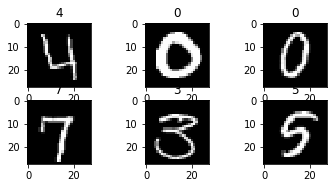
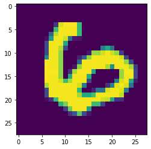
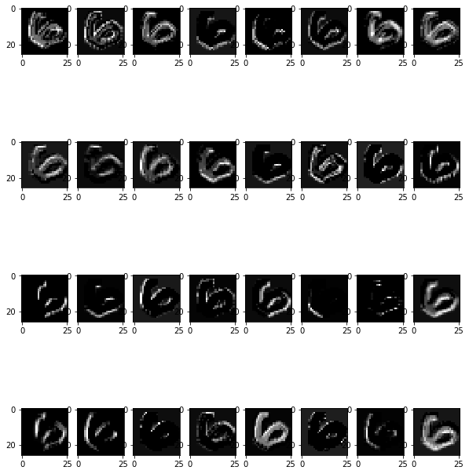
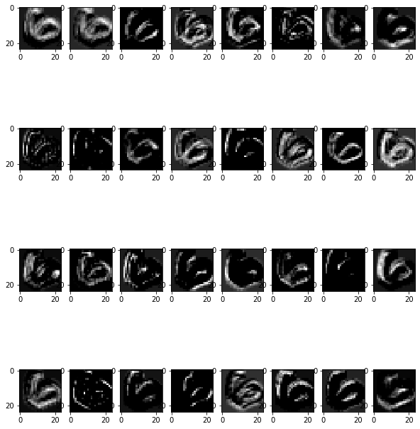
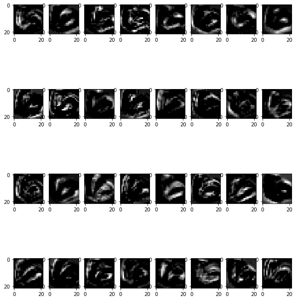
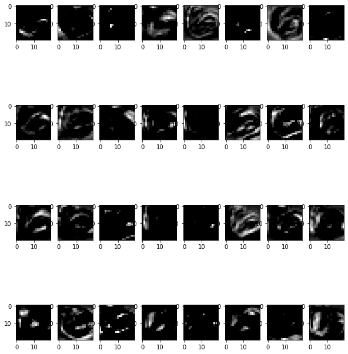
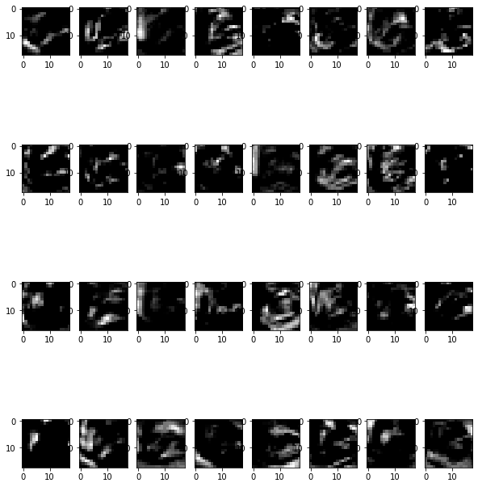
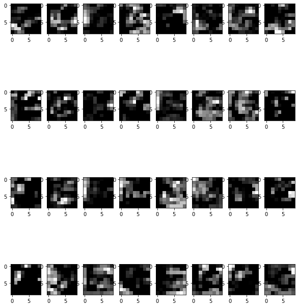
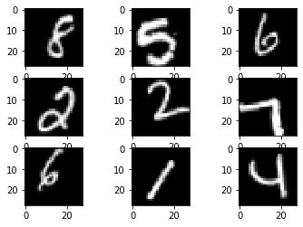

# Soupir Kaggle MNIST Notebook

## Importing

Since my GPU is AMD (RX 480 8 GB; OC'd to 1400MHz clock and VRAM to 2150 MHz), I used PlaidML for Keras in order to use it, rather than trying to get it to run on CPU. Previous testing had shown about a 7x improvement with GPU over CPU times.


```python
import plaidml.keras
plaidml.keras.install_backend()
```


```python
import tensorflow as tf
#from tensorflow import set_random_seed
#set_random_seed(333)

import keras
from keras.datasets import mnist
from keras.models import Sequential
from keras.layers import Dense, Dropout, Flatten
from keras.layers import Conv2D, MaxPooling2D
from keras.layers.normalization import BatchNormalization
from keras import backend as K
from keras.models import Model
from keras.preprocessing.image import ImageDataGenerator

from sklearn.model_selection import train_test_split

import numpy as np
import pandas as pd

import matplotlib.pyplot as plt
%matplotlib inline

import time
```

## Importing Data


```python
test = pd.read_csv("test.csv")
train = pd.read_csv("train.csv")
```

View the shape of the train and test data frames and the head of the data. Give some idea of the data that is being worked with.


```python
print(train.shape)
train.head()
```

    (42000, 785)
    


<div>
<style scoped>
    .dataframe tbody tr th:only-of-type {
        vertical-align: middle;
    }

    .dataframe tbody tr th {
        vertical-align: top;
    }

    .dataframe thead th {
        text-align: right;
    }
</style>
<table border="1" class="dataframe">
  <thead>
    <tr style="text-align: right;">
      <th></th>
      <th>label</th>
      <th>pixel0</th>
      <th>pixel1</th>
      <th>pixel2</th>
      <th>pixel3</th>
      <th>pixel4</th>
      <th>pixel5</th>
      <th>pixel6</th>
      <th>pixel7</th>
      <th>pixel8</th>
      <th>...</th>
      <th>pixel774</th>
      <th>pixel775</th>
      <th>pixel776</th>
      <th>pixel777</th>
      <th>pixel778</th>
      <th>pixel779</th>
      <th>pixel780</th>
      <th>pixel781</th>
      <th>pixel782</th>
      <th>pixel783</th>
    </tr>
  </thead>
  <tbody>
    <tr>
      <th>0</th>
      <td>1</td>
      <td>0</td>
      <td>0</td>
      <td>0</td>
      <td>0</td>
      <td>0</td>
      <td>0</td>
      <td>0</td>
      <td>0</td>
      <td>0</td>
      <td>...</td>
      <td>0</td>
      <td>0</td>
      <td>0</td>
      <td>0</td>
      <td>0</td>
      <td>0</td>
      <td>0</td>
      <td>0</td>
      <td>0</td>
      <td>0</td>
    </tr>
    <tr>
      <th>1</th>
      <td>0</td>
      <td>0</td>
      <td>0</td>
      <td>0</td>
      <td>0</td>
      <td>0</td>
      <td>0</td>
      <td>0</td>
      <td>0</td>
      <td>0</td>
      <td>...</td>
      <td>0</td>
      <td>0</td>
      <td>0</td>
      <td>0</td>
      <td>0</td>
      <td>0</td>
      <td>0</td>
      <td>0</td>
      <td>0</td>
      <td>0</td>
    </tr>
    <tr>
      <th>2</th>
      <td>1</td>
      <td>0</td>
      <td>0</td>
      <td>0</td>
      <td>0</td>
      <td>0</td>
      <td>0</td>
      <td>0</td>
      <td>0</td>
      <td>0</td>
      <td>...</td>
      <td>0</td>
      <td>0</td>
      <td>0</td>
      <td>0</td>
      <td>0</td>
      <td>0</td>
      <td>0</td>
      <td>0</td>
      <td>0</td>
      <td>0</td>
    </tr>
    <tr>
      <th>3</th>
      <td>4</td>
      <td>0</td>
      <td>0</td>
      <td>0</td>
      <td>0</td>
      <td>0</td>
      <td>0</td>
      <td>0</td>
      <td>0</td>
      <td>0</td>
      <td>...</td>
      <td>0</td>
      <td>0</td>
      <td>0</td>
      <td>0</td>
      <td>0</td>
      <td>0</td>
      <td>0</td>
      <td>0</td>
      <td>0</td>
      <td>0</td>
    </tr>
    <tr>
      <th>4</th>
      <td>0</td>
      <td>0</td>
      <td>0</td>
      <td>0</td>
      <td>0</td>
      <td>0</td>
      <td>0</td>
      <td>0</td>
      <td>0</td>
      <td>0</td>
      <td>...</td>
      <td>0</td>
      <td>0</td>
      <td>0</td>
      <td>0</td>
      <td>0</td>
      <td>0</td>
      <td>0</td>
      <td>0</td>
      <td>0</td>
      <td>0</td>
    </tr>
  </tbody>
</table>
<p>5 rows × 785 columns</p>
</div>


```python
print(test.shape)
test.head()
```

    (28000, 784)
    


<div>
<style scoped>
    .dataframe tbody tr th:only-of-type {
        vertical-align: middle;
    }

    .dataframe tbody tr th {
        vertical-align: top;
    }

    .dataframe thead th {
        text-align: right;
    }
</style>
<table border="1" class="dataframe">
  <thead>
    <tr style="text-align: right;">
      <th></th>
      <th>pixel0</th>
      <th>pixel1</th>
      <th>pixel2</th>
      <th>pixel3</th>
      <th>pixel4</th>
      <th>pixel5</th>
      <th>pixel6</th>
      <th>pixel7</th>
      <th>pixel8</th>
      <th>pixel9</th>
      <th>...</th>
      <th>pixel774</th>
      <th>pixel775</th>
      <th>pixel776</th>
      <th>pixel777</th>
      <th>pixel778</th>
      <th>pixel779</th>
      <th>pixel780</th>
      <th>pixel781</th>
      <th>pixel782</th>
      <th>pixel783</th>
    </tr>
  </thead>
  <tbody>
    <tr>
      <th>0</th>
      <td>0</td>
      <td>0</td>
      <td>0</td>
      <td>0</td>
      <td>0</td>
      <td>0</td>
      <td>0</td>
      <td>0</td>
      <td>0</td>
      <td>0</td>
      <td>...</td>
      <td>0</td>
      <td>0</td>
      <td>0</td>
      <td>0</td>
      <td>0</td>
      <td>0</td>
      <td>0</td>
      <td>0</td>
      <td>0</td>
      <td>0</td>
    </tr>
    <tr>
      <th>1</th>
      <td>0</td>
      <td>0</td>
      <td>0</td>
      <td>0</td>
      <td>0</td>
      <td>0</td>
      <td>0</td>
      <td>0</td>
      <td>0</td>
      <td>0</td>
      <td>...</td>
      <td>0</td>
      <td>0</td>
      <td>0</td>
      <td>0</td>
      <td>0</td>
      <td>0</td>
      <td>0</td>
      <td>0</td>
      <td>0</td>
      <td>0</td>
    </tr>
    <tr>
      <th>2</th>
      <td>0</td>
      <td>0</td>
      <td>0</td>
      <td>0</td>
      <td>0</td>
      <td>0</td>
      <td>0</td>
      <td>0</td>
      <td>0</td>
      <td>0</td>
      <td>...</td>
      <td>0</td>
      <td>0</td>
      <td>0</td>
      <td>0</td>
      <td>0</td>
      <td>0</td>
      <td>0</td>
      <td>0</td>
      <td>0</td>
      <td>0</td>
    </tr>
    <tr>
      <th>3</th>
      <td>0</td>
      <td>0</td>
      <td>0</td>
      <td>0</td>
      <td>0</td>
      <td>0</td>
      <td>0</td>
      <td>0</td>
      <td>0</td>
      <td>0</td>
      <td>...</td>
      <td>0</td>
      <td>0</td>
      <td>0</td>
      <td>0</td>
      <td>0</td>
      <td>0</td>
      <td>0</td>
      <td>0</td>
      <td>0</td>
      <td>0</td>
    </tr>
    <tr>
      <th>4</th>
      <td>0</td>
      <td>0</td>
      <td>0</td>
      <td>0</td>
      <td>0</td>
      <td>0</td>
      <td>0</td>
      <td>0</td>
      <td>0</td>
      <td>0</td>
      <td>...</td>
      <td>0</td>
      <td>0</td>
      <td>0</td>
      <td>0</td>
      <td>0</td>
      <td>0</td>
      <td>0</td>
      <td>0</td>
      <td>0</td>
      <td>0</td>
    </tr>
  </tbody>
</table>
<p>5 rows × 784 columns</p>
</div>


Using the `train` data frame to create the training data as well as the response for training. Then the data frames are then viewed.


```python
X_train = (train.iloc[:,1:].values).astype('float32') # all pixel values
y_train = train.iloc[:,0].values.astype('int32') # only labels i.e targets digits
X_test = test.values.astype('float32')
```


```python
X_train
```


    array([[0., 0., 0., ..., 0., 0., 0.],
           [0., 0., 0., ..., 0., 0., 0.],
           [0., 0., 0., ..., 0., 0., 0.],
           ...,
           [0., 0., 0., ..., 0., 0., 0.],
           [0., 0., 0., ..., 0., 0., 0.],
           [0., 0., 0., ..., 0., 0., 0.]], dtype=float32)


```python
y_train
```


    array([1, 0, 1, ..., 7, 6, 9])


Read somewhere that Keras doesn't automatically detect the dimensions of the images that are being worked with so it has to be reshaped for it to pick it up. Then viewing 6 of the images.


```python
#Convert train datset to (num_images, img_rows, img_cols) format 
X_train = X_train.reshape(X_train.shape[0], 28, 28)

for i in range(3, 9):
    plt.subplot(330 + (i+1))
    plt.imshow(X_train[i], cmap=plt.get_cmap('gray'))
    plt.title(y_train[i]);
```





```python
#expand 1 more dimention as 1 for colour channel gray
X_train = X_train.reshape(X_train.shape[0], 28, 28,1)
X_train.shape
```


    (42000, 28, 28, 1)


```python
X_test = X_test.reshape(X_test.shape[0], 28, 28,1)
X_test.shape
```


    (28000, 28, 28, 1)


Setting some variables to be used later for training the CNN. Also, the data off of Kaggle is pixel values, from 0 to 255. Dividing these values by 255 will standardize them between 0 and 1. I have generally done something similar to this when working with data that is continuous without a set max like this is, but it seems to be fairly common practice to keep it between 0 and 1 to prevent bias in predictors that are way higher than others and are mostly unrelated (such as using different experimental results; not using images)


```python
batch_size = 128
num_classes = 10
epochs = 20
```


```python
X_train = X_train.astype('float32')
X_test = X_test.astype('float32')
X_train /= 255
X_test /= 255
print('X_train shape:', X_train.shape)
print(X_train.shape[0], 'train samples')
print(X_test.shape[0], 'test samples')
```

    X_train shape: (42000, 28, 28, 1)
    42000 train samples
    28000 test samples
    

Convert response variable to categorical rather than numerical (an image of 1.1 doesn't make sense).


```python
# convert class vectors to binary class matrices
y_train = keras.utils.to_categorical(y_train, num_classes)
```


```python
num_classes = y_train.shape[1]
num_classes
```


    10


Need to set a random seed when splitting the data to keep it reproducible from run to run. The annotated training data is then split to a 90% training set and a 10% validation set for keras.


```python
np.random.seed(333)
```


```python
X = X_train
y = y_train
X_train, X_val, y_train, y_val = train_test_split(X_train,
                                                  y_train,
                                                  test_size=0.10,
                                                  random_state=42)
```


```python
print(X_train.shape)
print(y_train.shape)
print("\n")
print(X_val.shape)
print(y_val.shape)
```

    (37800, 28, 28, 1)
    (37800, 10)
    
    
    (4200, 28, 28, 1)
    (4200, 10)
    

Time to build the model! Here several convolutional layers are created with a 3x3 scanning window. I mostly just guessed and after training a handful of tries, I settled on 2x 32 conv layers, 2x 65 conv layers, 1x 128 conv layer, then a dropout followed by a 256 dense layer and another, larger, dropout before a final dense layer with the same number of outputs as the number of classes that is being predicted (10). The model is then compiled and fit using the train test splits of the annotated training data.


```python
input_shape = (28, 28, 1)
model = Sequential()
model.add(Conv2D(32, kernel_size=(3, 3),
                 activation='relu',
                 input_shape=input_shape))
model.add(Conv2D(32, (3, 3), activation='relu'))
model.add(BatchNormalization())
model.add(Conv2D(64, (3, 3), activation='relu'))
model.add(Conv2D(64, (3, 3), activation='relu'))
model.add(BatchNormalization())
model.add(Conv2D(128, (3, 3), activation='relu'))
model.add(BatchNormalization())
model.add(MaxPooling2D(pool_size=(2, 2)))
model.add(Dropout(0.25))
model.add(Flatten())
model.add(BatchNormalization())
model.add(Dense(256, activation='relu'))
model.add(Dropout(0.5))
model.add(BatchNormalization())
model.add(Dense(num_classes, activation='softmax'))
```

    INFO:plaidml:Opening device "opencl_amd_ellesmere.0"
    


```python
model.compile(loss=keras.losses.categorical_crossentropy,
              optimizer=keras.optimizers.Adadelta(),
              metrics=['accuracy'])
```


```python
start_time = time.time()
model.fit(X_train, y_train,
          batch_size=batch_size,
          epochs=epochs,
          verbose=1,
          validation_data=(X_val, y_val))
print("--- %s seconds ---" % (time.time() - start_time))
```

    Train on 37800 samples, validate on 4200 samples
    Epoch 1/20
    37800/37800 [==============================] - 63s 2ms/step - loss: 0.1353 - acc: 0.9601 - val_loss: 1.3904 - val_acc: 0.4562
    Epoch 2/20
    37800/37800 [==============================] - 28s 751us/step - loss: 0.0548 - acc: 0.9838 - val_loss: 0.0854 - val_acc: 0.9724
    Epoch 3/20
    37800/37800 [==============================] - 28s 753us/step - loss: 0.0371 - acc: 0.9889 - val_loss: 0.0555 - val_acc: 0.9824
    Epoch 4/20
    37800/37800 [==============================] - 28s 750us/step - loss: 0.0275 - acc: 0.9920 - val_loss: 0.0450 - val_acc: 0.9869
    Epoch 5/20
    37800/37800 [==============================] - 28s 751us/step - loss: 0.0226 - acc: 0.9934 - val_loss: 0.0296 - val_acc: 0.9905
    Epoch 6/20
    37800/37800 [==============================] - 28s 752us/step - loss: 0.0186 - acc: 0.9947 - val_loss: 0.0305 - val_acc: 0.9900
    Epoch 7/20
    37800/37800 [==============================] - 28s 748us/step - loss: 0.0139 - acc: 0.9959 - val_loss: 0.0309 - val_acc: 0.9893
    Epoch 8/20
    37800/37800 [==============================] - 28s 750us/step - loss: 0.0131 - acc: 0.9960 - val_loss: 0.0212 - val_acc: 0.9924
    Epoch 9/20
    37800/37800 [==============================] - 28s 749us/step - loss: 0.0109 - acc: 0.9965 - val_loss: 0.0265 - val_acc: 0.9910
    Epoch 10/20
    37800/37800 [==============================] - 28s 750us/step - loss: 0.0090 - acc: 0.9974 - val_loss: 0.0177 - val_acc: 0.9936
    Epoch 11/20
    37800/37800 [==============================] - 29s 754us/step - loss: 0.0073 - acc: 0.9979 - val_loss: 0.0196 - val_acc: 0.9933
    Epoch 12/20
    37800/37800 [==============================] - 28s 749us/step - loss: 0.0066 - acc: 0.9980 - val_loss: 0.0210 - val_acc: 0.9924
    Epoch 13/20
    37800/37800 [==============================] - 28s 749us/step - loss: 0.0057 - acc: 0.9981 - val_loss: 0.0227 - val_acc: 0.9933
    Epoch 14/20
    37800/37800 [==============================] - 28s 748us/step - loss: 0.0046 - acc: 0.9987 - val_loss: 0.0218 - val_acc: 0.9936
    Epoch 15/20
    37800/37800 [==============================] - 28s 747us/step - loss: 0.0050 - acc: 0.9985 - val_loss: 0.0200 - val_acc: 0.9938
    Epoch 16/20
    37800/37800 [==============================] - 28s 749us/step - loss: 0.0036 - acc: 0.9990 - val_loss: 0.0162 - val_acc: 0.9952
    Epoch 17/20
    37800/37800 [==============================] - 28s 751us/step - loss: 0.0032 - acc: 0.9990 - val_loss: 0.0199 - val_acc: 0.9931
    Epoch 18/20
    37800/37800 [==============================] - 29s 759us/step - loss: 0.0032 - acc: 0.9991 - val_loss: 0.0240 - val_acc: 0.9924
    Epoch 19/20
    37800/37800 [==============================] - 28s 753us/step - loss: 0.0028 - acc: 0.9993 - val_loss: 0.0306 - val_acc: 0.9912
    Epoch 20/20
    37800/37800 [==============================] - 28s 753us/step - loss: 0.0027 - acc: 0.9993 - val_loss: 0.0229 - val_acc: 0.9919
    --- 602.9864394664764 seconds ---
    

I've always been interested in how the different layers look like so I displayed each different step of the model to see how the conv layers were changing in what they were looking for.


```python
layer_outputs = [layer.output for layer in model.layers]
activation_model = Model(inputs=model.input, outputs=layer_outputs)
activations = activation_model.predict(X_train[10].reshape(1,28,28,1))
 
def display_activation(activations, col_size, row_size, act_index): 
    activation = activations[act_index]
    activation_index=0
    fig, ax = plt.subplots(row_size, col_size, figsize=(row_size*2.5,col_size*1.5))
    for row in range(0,row_size):
        for col in range(0,col_size):
            ax[row][col].imshow(activation[0, :, :, activation_index], cmap='gray')
            activation_index += 1
```


```python
plt.imshow(X_train[10][:,:,0]);
```





```python
model.summary()
```

    _________________________________________________________________
    Layer (type)                 Output Shape              Param #   
    =================================================================
    conv2d_1 (Conv2D)            (None, 26, 26, 32)        320       
    _________________________________________________________________
    conv2d_2 (Conv2D)            (None, 24, 24, 32)        9248      
    _________________________________________________________________
    batch_normalization_1 (Batch (None, 24, 24, 32)        128       
    _________________________________________________________________
    conv2d_3 (Conv2D)            (None, 22, 22, 64)        18496     
    _________________________________________________________________
    conv2d_4 (Conv2D)            (None, 20, 20, 64)        36928     
    _________________________________________________________________
    batch_normalization_2 (Batch (None, 20, 20, 64)        256       
    _________________________________________________________________
    conv2d_5 (Conv2D)            (None, 18, 18, 128)       73856     
    _________________________________________________________________
    batch_normalization_3 (Batch (None, 18, 18, 128)       512       
    _________________________________________________________________
    max_pooling2d_1 (MaxPooling2 (None, 9, 9, 128)         0         
    _________________________________________________________________
    dropout_1 (Dropout)          (None, 9, 9, 128)         0         
    _________________________________________________________________
    flatten_1 (Flatten)          (None, 10368)             0         
    _________________________________________________________________
    batch_normalization_4 (Batch (None, 10368)             41472     
    _________________________________________________________________
    dense_1 (Dense)              (None, 256)               2654464   
    _________________________________________________________________
    dropout_2 (Dropout)          (None, 256)               0         
    _________________________________________________________________
    batch_normalization_5 (Batch (None, 256)               1024      
    _________________________________________________________________
    dense_2 (Dense)              (None, 10)                2570      
    =================================================================
    Total params: 2,839,274
    Trainable params: 2,817,578
    Non-trainable params: 21,696
    _________________________________________________________________
    


```python
import matplotlib.pyplot as plt
import seaborn as sns
from keras.utils.vis_utils import plot_model
```


```python
plot_model(model, show_shapes=True, show_layer_names=True)
```


```python
display_activation(activations, 8, 4, 0)
```





```python
display_activation(activations, 8, 4, 1)
```





```python
display_activation(activations, 8, 4, 3)
```





```python
display_activation(activations, 8, 4, 4)
```





```python
display_activation(activations, 8, 4, 6)
```





```python
display_activation(activations, 8, 4, 8)
```





Now that the model is trained and has been looked at, time to make predictions for submissions


```python
predictions = model.predict_classes(X_test, verbose=0)
print(predictions)
```

    [2 0 9 ... 3 9 2]
    


```python
submission = pd.DataFrame({"ImageID":list(range(1,len(predictions)+1)),
                           "Label":predictions})
```


```python
#submission.to_csv("Soupir_results6.csv", index=False, header=True)
```

Saw online that some were recommending generating images with different wobbles and scaling to better train the model.


```python
datagen = ImageDataGenerator(
        featurewise_center=True,  # set input mean to 0 over the dataset
        samplewise_center=False,  # set each sample mean to 0
        featurewise_std_normalization=True,  # divide inputs by std of the dataset
        samplewise_std_normalization=False,  # divide each input by its std
        zca_whitening=False,  # apply ZCA whitening
        rotation_range=10,  # randomly rotate images in the range (degrees, 0 to 180)
        zoom_range = 0.1, # Randomly zoom image 
        width_shift_range=0.1,  # randomly shift images horizontally (fraction of total width)
        height_shift_range=0.1,  # randomly shift images vertically (fraction of total height)
        horizontal_flip=False,  # randomly flip images
        vertical_flip=False)  # randomly flip images

# X_train, X_val, y_train, y_val

datagen.fit(X_train)
```

There seemed to be a limit to the number of generated images that can be made (or at least I was not able to figure out how to overcome the limit which is something like 33,400 images), so here following what someone else had done I just created 64. 

My final submission though was just using the same data as before but letting Keras perform the split as 80/20 train/test. The generator didn't seem practical with the low number of generated images. 


```python
for X_batch, y_batch in datagen.flow(X_train, y_train, batch_size=64, shuffle=False, seed=333):
    # create a grid of 3x3 images
    for i in range(0, 9):
        plt.subplot(330 + 1 + i)
        plt.imshow(X_batch[i].reshape(28, 28), cmap=plt.get_cmap('gray'))
    # show the plot
    plt.show()
    break
```





```python
len(X_batch)
```


    64


To save time, I only have this notebook running 10 epochs but the final submission that I made used 500 (DEFINITELY hit the ceiling on diminishing returns but YOLO). This final one received a score of **0.99542** when submitted on kaggle, which is better than the previous submissions which were around **0.99071** to **0.99328**. This output, however, only scores **0.99342**. 


```python
model.fit(X, y, batch_size = batch_size, validation_split=0.2, epochs=10, verbose=1)
```

    Train on 33600 samples, validate on 8400 samples
    Epoch 1/10
    33600/33600 [==============================] - 44s 1ms/step - loss: 0.0070 - acc: 0.9977 - val_loss: 0.0042 - val_acc: 0.9988
    Epoch 2/10
    33600/33600 [==============================] - 26s 782us/step - loss: 0.0050 - acc: 0.9982 - val_loss: 0.0040 - val_acc: 0.9993
    Epoch 3/10
    33600/33600 [==============================] - 26s 780us/step - loss: 0.0045 - acc: 0.9987 - val_loss: 0.0034 - val_acc: 0.9993
    Epoch 4/10
    33600/33600 [==============================] - 26s 782us/step - loss: 0.0032 - acc: 0.9990 - val_loss: 0.0033 - val_acc: 0.9992
    Epoch 5/10
    33600/33600 [==============================] - 26s 781us/step - loss: 0.0023 - acc: 0.9995 - val_loss: 0.0024 - val_acc: 0.9993
    Epoch 6/10
    33600/33600 [==============================] - 26s 783us/step - loss: 0.0023 - acc: 0.9992 - val_loss: 0.0033 - val_acc: 0.9989
    Epoch 7/10
    33600/33600 [==============================] - 26s 781us/step - loss: 0.0018 - acc: 0.9996 - val_loss: 0.0018 - val_acc: 0.9995
    Epoch 8/10
    33600/33600 [==============================] - 26s 782us/step - loss: 0.0021 - acc: 0.9995 - val_loss: 0.0022 - val_acc: 0.9993 - loss: 0.0021 - acc: 0.
    Epoch 9/10
    33600/33600 [==============================] - 26s 779us/step - loss: 0.0012 - acc: 0.9996 - val_loss: 0.0028 - val_acc: 0.9990
    Epoch 10/10
    33600/33600 [==============================] - 26s 780us/step - loss: 0.0015 - acc: 0.9996 - val_loss: 0.0033 - val_acc: 0.9990
    


    <keras.callbacks.History at 0x19d6ca834a8>


```python
predictions = model.predict_classes(X_test, verbose=0)
submission = pd.DataFrame({"ImageID":list(range(1,len(predictions)+1)),
                           "Label":predictions})
submission.to_csv("Soupir_results_github.csv", index=False, header=True)
```
